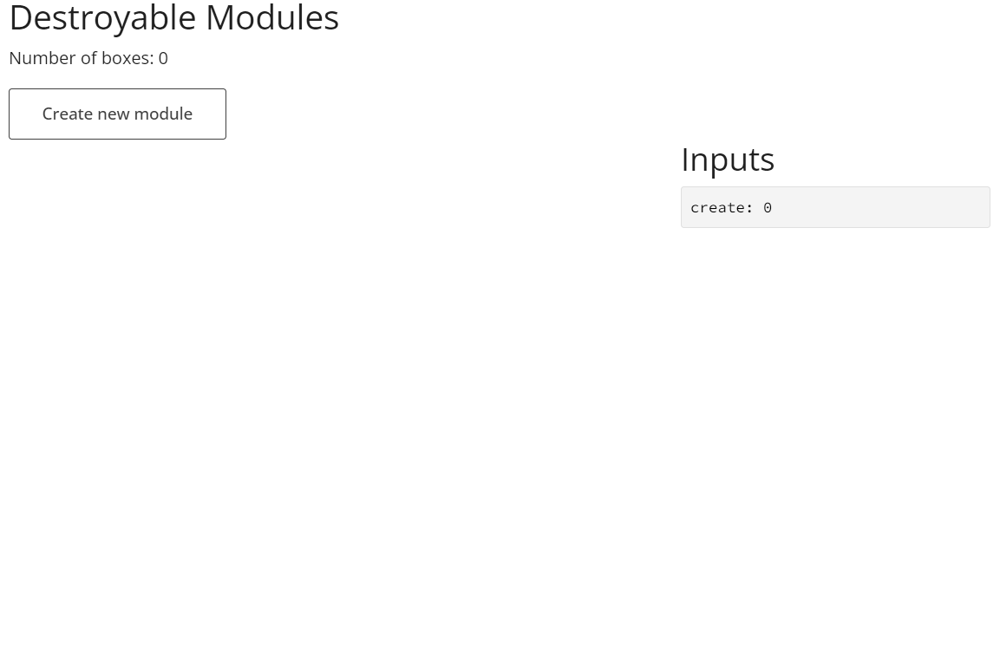

# shiny.destroy

<!-- badges: start -->
  
[](https://github.com/ashbaldry/shiny.destroy/actions/workflows/R-CMD-check.yaml)
  
<!-- badges: end -->

The aim of {shiny.destroy} is to allow inputs and modules created in a shiny application to be removed without keeping any trace of them within the realm of the shiny application.

## Installation

Install the latest version of {shiny.destroy} on GitHub

```r
require("remotes")
remotes::install_github("ashbaldry/shiny.destroy")
```

## Usage

There are two types of objects that {shiny.destroy} handles: inputs and modules.

### Input

Use the function `removeInput` to remove the desired input. This is a wrapper around `shiny::removeUI`, but includes ways to reference the input server-side, and updates any reactives and/or outputs that depend on that input instantly.

### Module

Prior to the application loading.

## Example



The code for this example is available in the [examples directory](/inst/examples-shiny)

## Limitations

To include sub-modules within the destroyable module, the server-side module will need to be passed through `makeModuleServerDestroyable` and included as an argument to the parent module to ensure those observers are safely removed.
