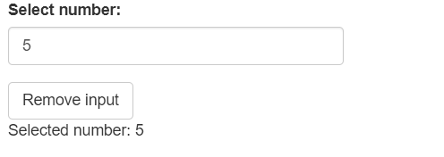
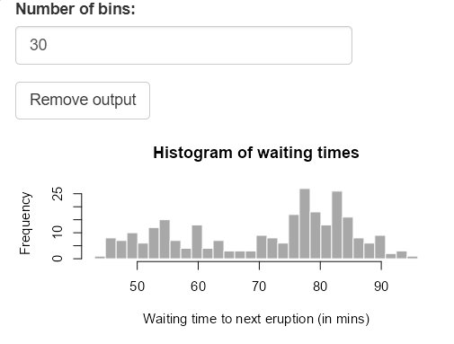
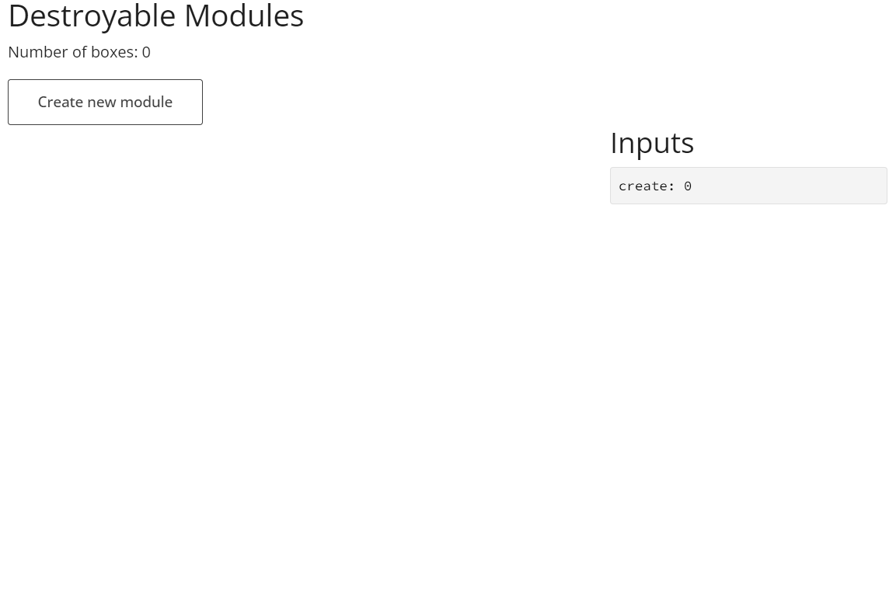
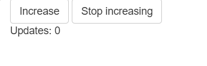

```{r setup, include = FALSE}
knitr::opts_chunk$set(
  eval = FALSE,
  collapse = TRUE,
  comment = "#>"
)
```

As shiny applications become larger and more complex, there are requirements to dynamically show inputs, results and even entire modules. Functionality exists to be able to dynamically update the UI and server, however when removing the UI, traces of the input are still available throughout the application which may cause some unexpected behaviour. The aim of {shiny.destroy} is to eliminate all traces of the removed UI in the shiny application, providing the assurance that only the required observers and outputs are rendered after removal.

## Inputs

The front-end part of shiny inputs can easily be removed by using the `removeUI` function, however this does not impact the server side, where the input is still accessible. 

```{r basic_ui}
library(shiny)

ui <- fluidPage(
  numericInput("number", "Select number:", 5L, 1L, 10L),
  actionButton("delete", "Remove input"),
  p("Selected number:", textOutput("number_out", inline = TRUE))
)

server <- function(input, output, session) {
  output$number_out <- renderText(input$number)

  observeEvent(input$delete, removeUI("#number"))
}

shinyApp(ui, server)
```



With `removeInput`, both the front and back end remove the input, and any observer or output that references the removed input will be updated. Whilst the trick of using `.subset2(input, "impl")$remove(id)` is known to remove the input, it does not trigger anything. Within the `input` object, the names are all stored within the `.namesOrder` and needs to be removed from here too.

After the input has been removed, the session needs to be aware that the input has been removed, otherwise nothing will be updated. This is where the invalidation of the various values is required, referencing the names and value dependency environments within the input object.

With all this resolved, the input is now fully removed from the shiny instance.

```{r destroy_ui}
library(shiny)
library(shiny.destroy)

ui <- fluidPage(
  numericInput("number", "Select number:", 5L, 1L, 10L),
  actionButton("delete", "Remove input"),
  p("Selected number:", textOutput("number_out", inline = TRUE))
)

server <- function(input, output, session) {
  output$number_out <- renderText(input$number %||% "input unavailable")

  observeEvent(
    input$delete,
    removeInput("number", selector = ":has(> #number)")
  )
}

shinyApp(ui, server)
```


## Output

Outputs can be removed in shiny applications by using a combination of `removeUI` and assigning `NULL` to the relevant output ID server-side; `removeOutput` is a wrapper for both operations. When assigning the output `NULL`, rather than removing the output entirely, it instead creates a reactive using `req(FALSE)` so that the output will never be updated.

```{r destroy_output}
library(shiny)
library(shiny.destroy)

ui <- fluidPage(
  numericInput("bins", "Number of bins:", min = 1L, max = 50L, value = 30L),
  actionButton("delete", "Remove output"),
  plotOutput("distPlot", height = "200px", width = "400px")
)

server <- function(input, output, session) {
  output$distPlot <- renderPlot({
    x <- faithful[, 2L]
    bins <- seq(min(x), max(x), length.out = input$bins + 1L)
    hist(
      x,
      breaks = bins,
      col = "darkgray",
      border = "white",
      xlab = "Waiting time to next eruption (in mins)",
      main = "Histogram of waiting times"
    )
  })

  observeEvent(input$delete, removeOutput("distPlot"))
}

shinyApp(ui, server)
```



## Module

In larger shiny applications, modules are beneficial to reduce the application down into smaller, reusable chunks. There are situations where these modules can be dynamically added to the application, but also want to be removed. By using `removeUI`, we can remove the HTML of the module, however there are still a load of server-side processes that will be running even with the module "removed". {shiny.destroy} makes sure that any trace of the module is no longer available within the application. 

```{r module_example}
shiny::runExample(
  "01_boxes",
  package = "shiny.destroy"
)
```



The inputs and outputs are removed in the same way as an individual input or output, however additional objects in a module need to be addressed to properly destroy the module. `observe` and `observeEvent` are eager, and execute whenever any of the triggers are updated. If you assign an observer to a variable, you can see that it too is an R6 object with several methods. To prevent an observer from evaluating, you can use the `$destroy()` method.

```{r stop_observer}
library(shiny)

ui <- fluidPage(
  actionButton("update", "Increase"),
  actionButton("stop", "Stop increasing"),
  p("Updates:", textOutput("number_out", inline = TRUE))
)

server <- function(input, output, session) {
  clicks <- reactiveVal(0L)

  update_obs <- observeEvent(input$update, clicks(clicks() + 1L))

  observeEvent(input$stop, update_obs$destroy())

  output$number_out <- renderText(clicks())
}

shinyApp(ui, server)
```



When it comes to modules, these triggers can potentially be inputs or reactive values that are passed into the module. Removing a module from the shiny session won't disable these observers, so in order for `destroyModule` to remove these observers, the module function needs to be passed into `makeModuleServerDestroyable`. This assigns all observers to the user session data so that when the module is destroyed, the observers can be too.

### Sub-Modules

Whilst the module code can be updated so that the observers can be destroyed with a single click, it is hard to find sub-modules called within the module code. Therefore these should be included as arguments to the server-side module, using `makeModuleServerDestroyable`, so that these observers will be destroyed too.
